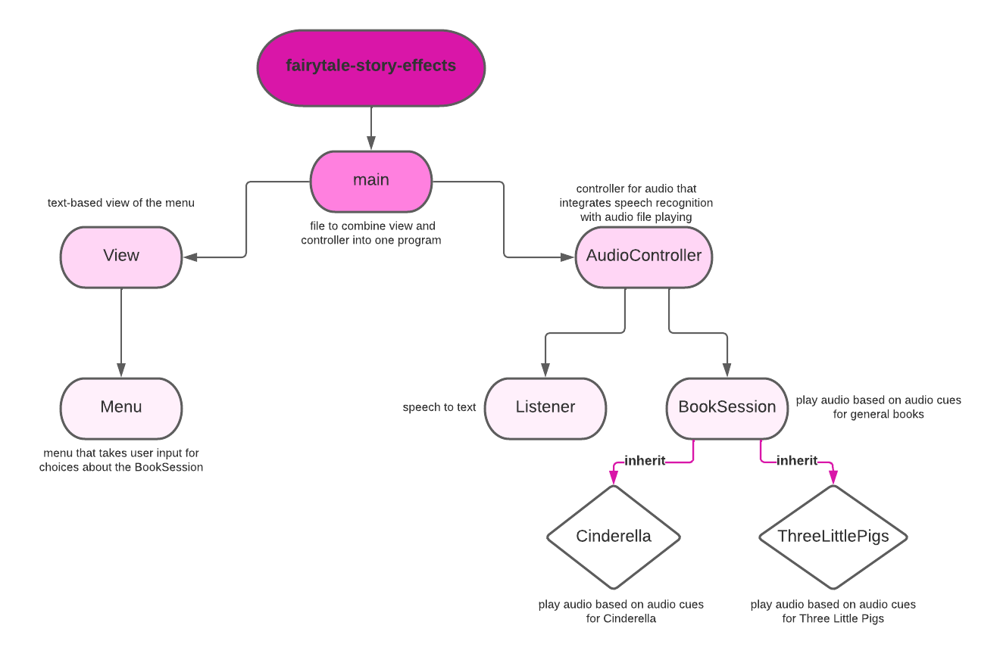

# Fairytale Sound Effects
#### Authors: Emma Mascillaro, Rucha Dave

## **Project Summary**:
This repository contains our 2022 Software Design Final project.

This interactive application uses Speech Recognition to play sound effects as a user reads a story out loud.  Audio data is collected as a user speaks and is transcribed to text using Google's Speech Recognition API.  When keywords are recognized in the user's speech, corresponding sound effects are played through Pygame in order to enhance the reader's reading experience.

Some challenges faced in this project included the timeout and delay involved when using SpeechRecognition.  In the future, we plan to switch to using LiveSpeech from pocketsphinx in order to reduce this time delay. 

#### **Code Architecture**
The architecture for this project was made in accordance with the MVC structure (Model, View, Controller). 

- **Model**: The code to connect audio cues to directories and play the correct audio (`BookSession` and subclasses `Cinderella` and `ThreeLittlePigs`) as well as code involving speech recognition (`Listener`)
- **View**: The code involving an user interface (the abstract class `View` and the text based menu `MenuStates`)
- **Controller**: The code that integrates the various aspects of the model and controls the input of audio for an entire session for a book (`AudioController`)

## **Setup and Installation:**

Clone this github repository onto your local device and install the following Python Packages.

Audio Transcription:
1. SpeechRecognition - `pip install SpeechRecognition`

Audio Playing:
1. time - This should come as part of the Python package
2. os - This should come as part of the Python package
3. random - This should come as part of the Python package
4. pygame - `pip install pygame`

### A Note about Pytest: ###
The following files in the repository are used for testing purposes. These cover all relevant scenarios for testing purposes:

* `test_audio_controller.py`
* `test_book_session.py`
* `test_cinderella.py`
* `test_three_little_pigs.py`
* `test_menu_states.py` - In order to properly run this Pytest, use the `-s` command line option to give user input

Since `listener.py` uses the SpeechRecognition API, which deals with inputted audio, testing for this was performed through rigorous manual testing. Both of the stories were read out loud completely by both Rucha and Emma, and individual cues were tested multiple times as well. Additionally, other sentences that both included and didn't include the cues were tested repeatedly to ensure words were being recognized accurately. 

## **Usage:**
Compiling `main.py` will begin the program.  Follow the prompts displayed in the terminal in order to indicate the story to be read.  A text file popup containing the story will appear once a story is selected.  At this point, users will be prompted to begin reading.  Audio will automatically be played as the user begins reading and a live transcription of the user's speech will be printed in the terminal.

*Disclaimer:  This program currently works best when the reader pauses frequently as they read in order to allow the Speech Recognition API time to save and process the audio data being received.*
