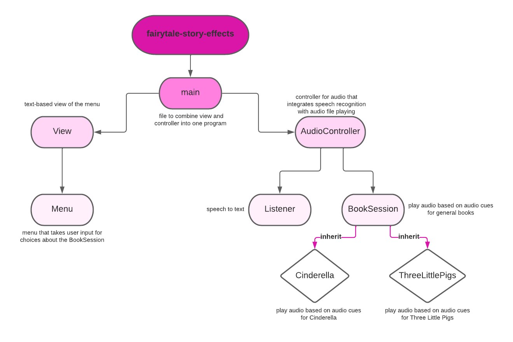
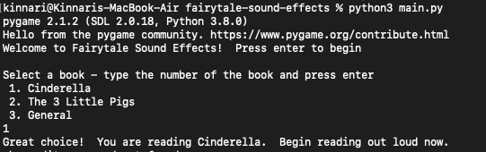

# Magical Tales

## About the Project
Imagine telling your child a bedtime story, when suddenly, the Big Bad Wolf howls! Exciting, right? We introduce _Magical Tales_, a program that responds with audio to the story you are telling. Implemented in Python3, Magical Tales currently can provide audio for both a general version that can be applied to all fairy tales and individualized sessions for the stories Cinderella and Three Little Pigs. Now, your stories can come to life!

Interactive Fairytales was created by, and is the intellectual property of, Rucha Dave and Emma Mascillaro. Developed as a final project for Software
Design at Olin College of Engineering, the ultimate purpose of this project was to explore Speech Recognition and practice developing complex architecture with respect to a MVC (Model, View, Controller) structure.

Check out our source code for documentation and watch an example run in action!

[Source Code](https://github.com/olincollege/fairytale-sound-effects)

[Cinderella Demo](video1106553709.mp4)

[General Demo](general_story(1).mp4)

## MVC Design

Our code is separated into three main logical components: Model, View, Controller. Each architecture component handles one of the main aspects of the program.

### Code Architecture

- **Model**: 
  The code to connect audio cues to directories and play the correct audio (`BookSession` and subclasses `Cinderella` and `ThreeLittlePigs`) as well as code involving speech recognition (`Listener`)
- **View**:
  The code involving an user interface (the abstract class `View` and the text based `MenuStates`)
  
- **Controller**: 
  The code that integrates the various aspects of the model and controls an entire session for a book (`AudioController`)

### Features

Our program uses two main features to ensure it runs smoothly: Google's SpeechRecognition API and Pygame. Below are descriptions of how each are used in our code. 

- **SpeechRecognition**: Google's SpeechRecognition API uses the local device's microphone to capture audio and convert it to text. In our program, we use SpeechRecognition to listen to the story being told and convert sentences into text. These are later parsed through by other functions to check for cue words. This is done by adjusting the `Recognizer` for ambient noise and converting the audio to the English speech that was detected.
- **Pygame**: Pygame allowed us to play audio files that corresponded with the key words detected in the text. 
